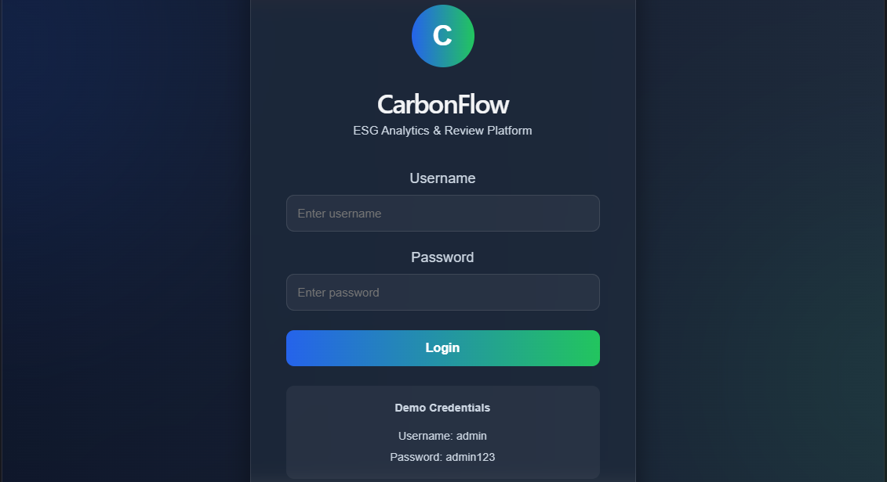
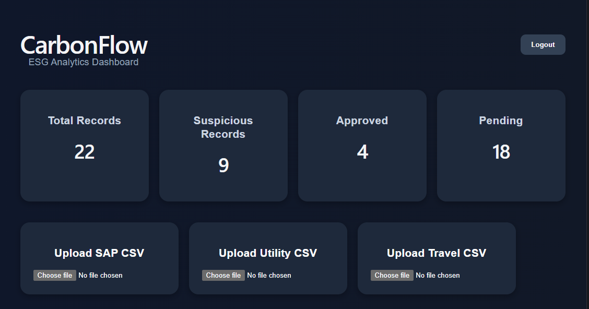
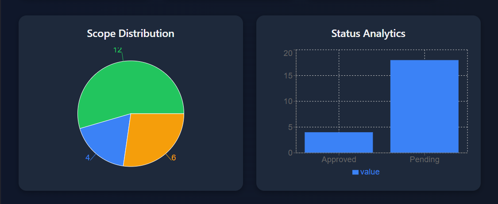
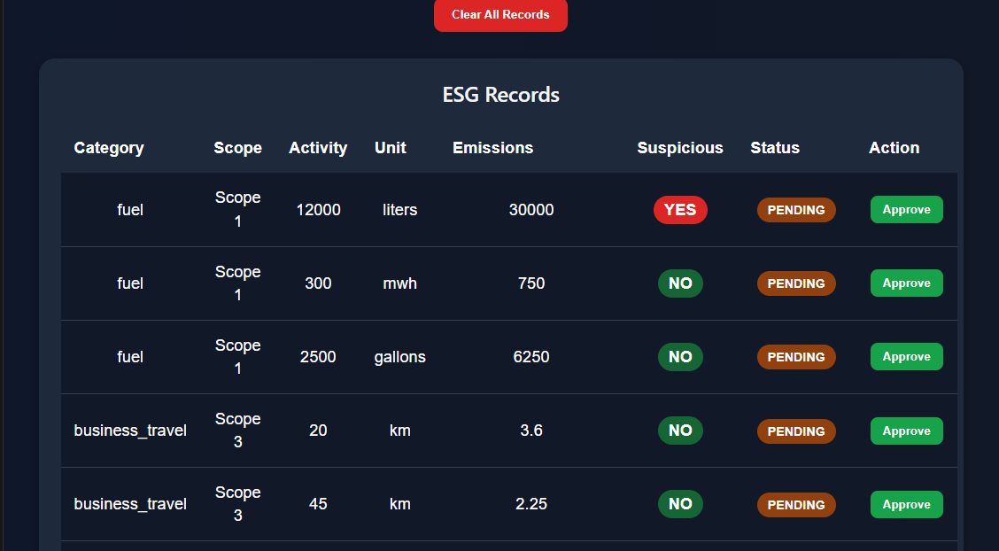
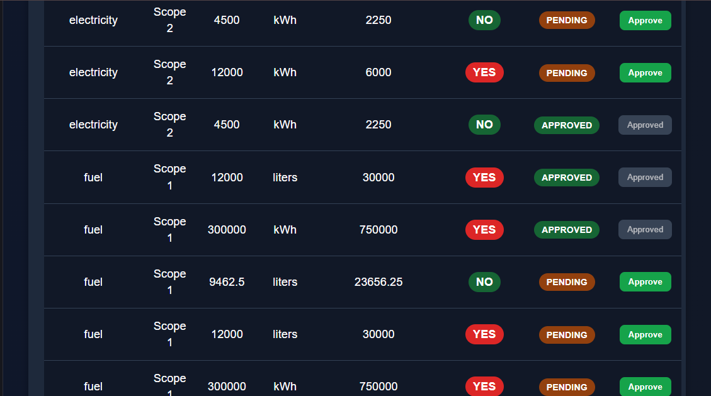

# CarbonFlow 🌍

CarbonFlow is a full-stack ESG (Environmental, Social, and Governance) data ingestion and analytics platform built using Django REST Framework and React.

The platform allows organizations to upload ESG-related operational data from multiple business sources, normalize the records, calculate carbon emissions, detect suspicious anomalies, and review records through an analyst dashboard.

---

# 🚀 Features

## Multi-Source ESG Data Ingestion

Supports:

* SAP Fuel Data
* Utility Electricity Data
* Travel Data

---

## ESG Scope Classification

Automatically classifies emissions into:

* Scope 1
* Scope 2
* Scope 3

---

## Emissions Calculation Engine

Calculates CO₂ emissions using source-specific emission factors.

Examples:

* Fuel emissions
* Electricity emissions
* Travel emissions

---

## Suspicious Data Detection

Flags abnormal operational values for analyst review.

Examples:

* unusually high fuel usage
* excessive electricity consumption
* abnormal travel distances

---

## Analyst Review Workflow

Analysts can:

* review records
* approve records
* monitor suspicious entries

---

## Analytics Dashboard

Interactive dashboard includes:

* KPI cards
* emissions analytics
* source-wise emissions chart
* scope distribution chart
* approval workflow table

---

# 🛠️ Tech Stack

## Backend

* Django
* Django REST Framework
* SQLite

## Frontend

* React
* Vite
* Axios
* Recharts

---

# 📊 Supported ESG Sources

| Source                   | ESG Scope | Category        |
| ------------------------ | --------- | --------------- |
| SAP Fuel Data            | Scope 1   | Fuel            |
| Utility Electricity Data | Scope 2   | Electricity     |
| Travel Data              | Scope 3   | Business Travel |

---

# ⚙️ System Workflow

```text
CSV Upload
   ↓
Data Ingestion
   ↓
Normalization
   ↓
Emissions Calculation
   ↓
Suspicious Detection
   ↓
Analyst Review
   ↓
Dashboard Analytics
```

---

# 📂 Project Structure

```text
CarbonFlow/
│
├── backend/
│   ├── emissions/
│   ├── manage.py
│
├── frontend/
│   ├── src/
│   ├── package.json
│
└── README.md
```

---

# 🔥 Key Functionalities

## SAP Upload

Uploads fuel operational data and calculates Scope 1 emissions.

---

## Utility Upload

Processes electricity usage data and calculates Scope 2 emissions.

---

## Travel Upload

Processes employee travel activity and calculates Scope 3 emissions.

---

# 📈 Dashboard Capabilities

The dashboard provides:

* real-time ESG analytics
* source tracking
* scope visualization
* suspicious activity identification
* emissions monitoring

---

# ▶️ Backend Setup

## Navigate to backend

```bash
cd backend
```

## Install dependencies

```bash
pip install django djangorestframework pandas django-cors-headers
```

## Run migrations

```bash
python manage.py makemigrations
python manage.py migrate
```

## Start backend server

```bash
python manage.py runserver
```

---

# ▶️ Frontend Setup

## Navigate to frontend

```bash
cd frontend
```

## Install dependencies

```bash
npm install
npm install axios recharts
```

## Start frontend server

```bash
npm run dev
```

---

# 🌐 API Endpoints

| Endpoint             | Method | Description              |
| -------------------- | ------ | ------------------------ |
| /api/upload/sap/     | POST   | Upload SAP data          |
| /api/upload/utility/ | POST   | Upload utility data      |
| /api/upload/travel/  | POST   | Upload travel data       |
| /api/records/        | GET    | Fetch normalized records |
| /api/approve/<id>/   | POST   | Approve a record         |

---

# Screenshots

# 📷 Screenshots

## Login Page



---

## Dashboard Overview



---

## Dashboard Analytics



---


## Records Table View 1



---

## Records Table View 2




# Future Improvements

Potential future enhancements:

* Authentication & role-based access
* Batch tracking
* AI-powered anomaly detection
* ESG reporting export
* Cloud deployment
* PostgreSQL integration
* Real-time notifications

---

# Author

Developed by Jithisha K V

Computer Science Engineering Student
